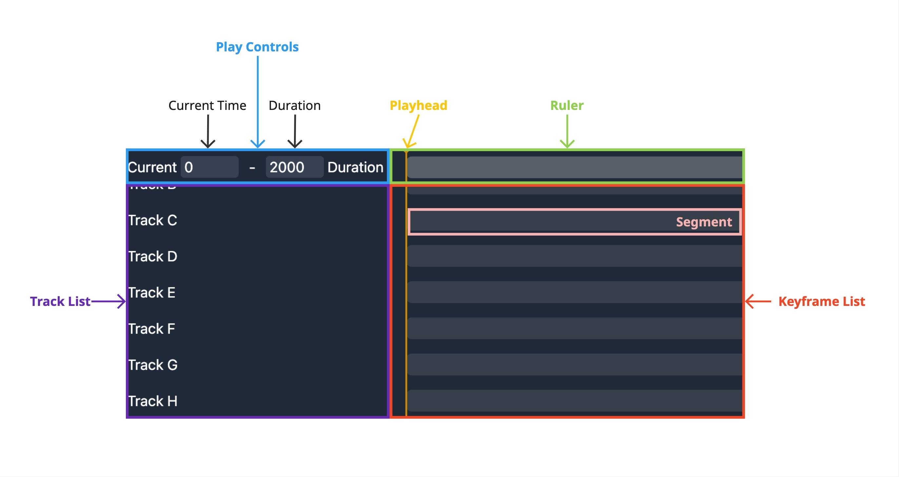

# Phase Timeline Challenge Submission

<!-- ## Overview -->

<!-- Implement interactive features for a Timeline component. We will provide a basic Timeline component scaffold, and your task is to implement the functionality that meets the user behavior requirements outlined below.

## Glossary

- **Timeline**: The main component that visually represents the duration of a sequence of events or changes over time.
- **Playhead**: The visual indicator that shows the current time position on the Timeline.
- **Current Time**: The specific time point indicated by the Playhead's position.
- **Duration**: The total length of time represented by the Timeline.
- **Ruler**: The component showing time measurements and increments along the Timeline.
- **Track**: A horizontal lane on the Timeline that can contain multiple Keyframes, often used to group related events or changes.
- **Track List**: The component that displays and manages multiple Tracks.
- **Keyframe**: A marked point on the Timeline representing a significant event, change, or state.
- **Keyframe List**: The component that shows the Keyframes across all Tracks, synchronized with the Ruler.
- **Segment**: The visual representation of the Timeline's duration in the Keyframe List. -->

## Tests files and folders

- `src/NumberInput/__tests__/index.test.tsx` - Tests for the Number Input component
- `src/Timeline/__tests__/PlayControls.test.tsx` - Tests for the PlayControls component
- `src/Timeline/__tests__/Ruler.test.tsx` - Tests for the
  Ruler component
- `src/Timeline/__tests__/TrackList.test.tsx` - Tests for the
- Track List component
- `src/Timeline/__tests__/KeyframeList.test.tsx` - Tests for the Keyframe List component
- `src/Timeline/__tests__/Playhead.test.tsx` - Tests for the Playhead component component

<table cellspacing="0" cellpadding="0" style="width:100%; text-align: center;">
  <tr>
    <td></td>
    <td></td>
    <td></td>
  </tr>
  <tr>
    <td></td>
    <td></td>
    <td></td>
  </tr>
  <tr>
    <td></td>
    
  </tr>
  </table>

## User Behavior Requirements

### 1. Number Input Field

#### Interface

| Prop          | Type                             | Required | Description                                                        |
| :------------ | :------------------------------- | :------: | :----------------------------------------------------------------- |
| `value`       | `number`                         | &#10004; | The current value of the input field                               |
| `onChange`    | `(value: number) => void`        | &#10004; | Callback function called when the value changes                    |
| `min`         | `number`                         | &#10004; | Minimum allowed value                                              |
| `max`         | `number`                         | &#10004; | Maximum allowed value                                              |
| `step`        | `number`                         | &#10004; | Step value for increment/decrement operations                      |
| `onKeyDown`   | `(event: KeyboardEvent) => void` | &#8211;  | Optional callback for handling keyboard events                     |
| `data-testid` | `string`                         | &#8211;  | Optional test ID for testing purposes (defaults to "number-input") |

#### Behavior

- [x] The input field displays the current value
- [x] The displayed value updates immediately while typing, but `onChange` is not triggered until input is confirmed
- [x] Clicking outside the input field removes focus and changes the value
- [x] Clicking on the native step buttons immediately changes the value
- [x] Pressing up arrow or down arrow keys immediately changes the value
- [x] Entire text is selected when the input field gains focus
- [x] Entire text is selected after using the native step buttons
- [x] Entire text is selected after using the up arrow or down arrow keys
- [x] Pressing Enter confirms the new value and removes focus
- [x] Pressing Escape reverts to the original value and removes focus
- [x] Leading zeros are automatically removed
- [x] Negative values are automatically adjusted to the minimum allowed value
- [x] Decimal values are automatically rounded to the nearest integer
- [x] Invalid inputs (non-numeric) revert to the previous valid value

### 2. Play Controls Behavior

#### Interface

| Prop          | Type                         | Required | Description                         |
| :------------ | :--------------------------- | :------: | :---------------------------------- |
| `time`        | `number`                     | &#10004; | Current time value in milliseconds  |
| `setTime`     | `(time: number) => void`     | &#10004; | Callback to update the current time |
| `duration`    | `number`                     | &#10004; | Total duration in milliseconds      |
| `setDuration` | `(duration: number) => void` | &#10004; | Callback to update the duration     |

Behavior Test Case

- [x] Current Time is always between `0ms` and the Duration
- [x] Current Time adjusts if it exceeds the newly set Duration
- [x] Duration is always between `100ms` and `6000ms`
- [x] Current Time and Duration are always multiples of `10ms`
- [x] Current Time and Duration are always positive integers
- [x] Playhead position updates only after specific actions on Current Time input (losing focus, pressing Enter, using arrow keys, or clicking up/down buttons)

### 3. Ruler Behavior

#### Interface

| Prop       | Type                        | Required | Description                         |
| :--------- | :-------------------------- | :------: | :---------------------------------- |
| `time`     | `number`                    | &#10004; | Current time value in milliseconds  |
| `setTime`  | `(time: number) => void`    | &#10004; | Callback to update the current time |
| `duration` | `number`                    | &#10004; | Total duration in milliseconds      |
| `rulerRef` | `RefObject<HTMLDivElement>` | &#10004; | Ref for scroll synchronization      |

- [x] Clicking or dragging on the Ruler updates the Current Time and Playhead position
- [x] Horizontal scrolling of the Ruler is synchronized with the Keyframe List
- [x] Ruler length visually represents the total Duration (`1ms = 1px`)
- [x] Ruler length updates only after specific actions on Duration input (losing focus, pressing Enter, using arrow keys, or clicking up/down buttons)

### 4. Track List Behavior

#### Interface

| Prop              | Type                        | Required | Description                                       |
| :---------------- | :-------------------------- | :------: | :------------------------------------------------ |
| `trackListRef`    | `RefObject<HTMLDivElement>` | &#10004; | Ref for scroll synchronization                    |
| `keyframeListRef` | `RefObject<HTMLDivElement>` | &#10004; | Ref for scroll synchronization with Keyframe List |

Behavior test

- [x] Vertical scrolling of the Track List is synchronized with the Keyframe List

### 5. Keyframe List Behavior

#### Interface

| Prop              | Type                        | Required | Description                               |
| :---------------- | :-------------------------- | :------: | :---------------------------------------- |
| `duration`        | `number`                    | &#10004; | Total duration in milliseconds            |
| `keyframeListRef` | `RefObject<HTMLDivElement>` | &#10004; | Ref for horizontal scroll synchronization |
| `rulerRef`        | `RefObject<HTMLDivElement>` | &#10004; | Ref for horizontal scroll synchronization |
| `trackListRef`    | `RefObject<HTMLDivElement>` | &#10004; | Ref for vertical scroll synchronization   |

Behavior test

- [x] Vertical scrolling is synchronized with the Track List
- [x] Horizontal scrolling is synchronized with the Ruler
- [x] Segment length visually represents the total Duration (`1ms = 1px`)
- [x] Segment length updates only after specific actions on Duration input (losing focus, pressing Enter, using arrow keys, or clicking up/down buttons)

### 6. Playhead Behavior

#### Interface

| Prop         | Type     | Required | Description                        |
| :----------- | :------- | :------: | :--------------------------------- |
| `time`       | `number` | &#10004; | Current time value in milliseconds |
| `scrollLeft` | `number` | &#10004; | Current horizontal scroll position |
| `duration`   | `number` | &#10004; | Total duration in milliseconds     |

Behavior test

- [x] Playhead moves in sync with the Ruler and Keyframe List during horizontal scrolling
- [x] Playhead maintains its relative position during horizontal scrolling
- [x] Playhead is visible only when within the Timeline's visible area, using the `hidden` attribute when completely out of view

## Implementation Guidelines

- Implement the required behaviors in the appropriate child components of the provided Timeline
- Write comprehensive tests to ensure that the implementation meets the user behavior requirements, including edge cases
- Consider performance implications, such as minimizing unnecessary re-renders
- Pay attention to user experience and interface design
- Write clean, well-documented, and maintainable code
